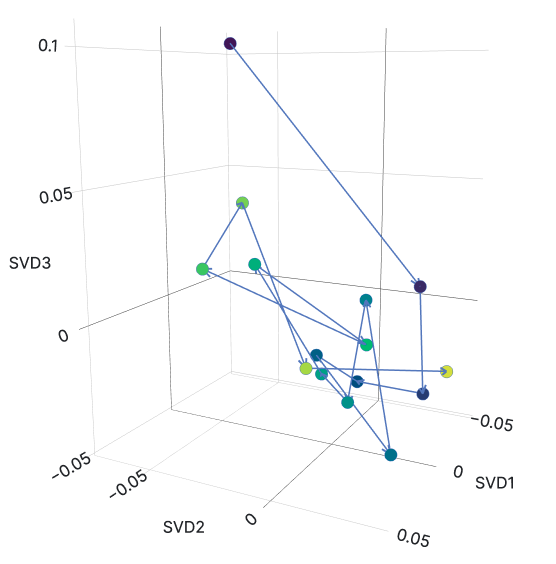

# 3dENA

3D ENA is an R/Shiny application for exploring Epistemic Network Analysis
(ENA) sets in a shared three-dimensional rotation. It displays ENA points,
code nodes, group and unit networks, group comparisons, change snapshots, and
ordered centroid trajectories.



## Main features

- Select any three ENA dimensions for a 3D view.
- Inspect overall, group, unit, comparison, and change views.
- Compute an ordered path of group centroids from raw ENA point coordinates.
- Report step distance, cumulative distance, elapsed interval, and speed.
- Choose an available-at-each-time or complete longitudinal cohort.
- Calculate distance in the selected axes or the full ENA rotation.
- Project an unchanged trajectory result into 2D or render it in 3D.
- Add participant-clustered bootstrap intervals.
- Compare two condition paths after exact entity-and-time matching.
- Overlay the mean ENA network for a selected time.
- Optionally request evidence-linked Qwen interpretation of aggregate results
  on the 3D ENA page, with a fresh bound preview and consent before transfer.
- Export path, uncertainty, comparison, and metadata CSV files, with
  diagnostics included in the metadata export.

See [Trajectory Analysis](TRAJECTORY_ANALYSIS.md) for definitions,
assumptions, output fields, and interpretation guidance.

## Requirements

- R 4.4.1 for the locked production environment.
- A raw `.csv`, `.xlsx`, or `.xls` table; one of the reviewed sample files in
  `sample_data/`; or a versioned `.ena3d.json` exchange file. Public native-R
  upload remains disabled; see **Load or build ENA data** below.
- The following R packages:

```r
install.packages(c(
  "shiny",
  "plotly",
  "data.table",
  "R6",
  "rENA",
  "bslib",
  "scales",
  "digest",
  "jsonlite",
  "curl",
  "readxl",
  "callr",
  "later",
  "promises",
  "zip"
))
```

The app checks dependencies at startup and does not install packages or modify
the R library automatically. For an exact environment, run these commands from
the repository root; the committed renv activation makes the restored project
library available to each subsequent R process:

```sh
Rscript renv/bootstrap.R
Rscript tests/check.R
```

`renv.lock` records runtime and test dependencies.

## Run locally

Clone the public repository:

```sh
git clone https://github.com/HUDongpin/3dENA.git
cd 3dENA
```

Start the app from the repository root:

```sh
Rscript -e "shiny::runApp('R', launch.browser = TRUE)"
```

Alternatively, open `ENA_3D.Rproj` in RStudio and run `R/app.R` with `R/` as
the working directory.

## Load or build ENA data

To explore the included fixtures, open **Data**, select a file under
**Sample dataset**, and load it. `sample_data/newfrat_enaset.Rdata` is the
longitudinal example: it contains 15 weeks and 17 repeated entities per week.

The **Build ENA from raw Excel or CSV** workflow accepts `.csv`, `.xlsx`, and
`.xls` files up to 5 MiB. After upload, select:

- one or more unit identifier fields;
- one or more conversation/sequence fields;
- at least three complete, non-negative numeric code columns;
- optional unit-level metadata and one primary grouping field;
- the endpoint or trajectory model, co-occurrence window, and rotation.

Code values greater than zero are modeled as presence and zero as absence.
Unit-level metadata must not change within a unit. If labels such as
`Student 1` are reused for different people in different groups, include both
the group and student fields in **Unit identifier field(s)**. The importer
checks this relationship and refuses mappings that would merge those people.
The raw table is parsed and previewed first; the active ENA dataset changes
only after mapping validation, co-occurrence accumulation, rotation, and the
regular ENA object validator all succeed. The resulting object immediately
feeds the existing Overall, Networks, Comparison, Change, Stats, and Trajectory
views, including 3D paths, bootstrap, comparisons, and CSV exports.

The public site also accepts a pure-data `.ena3d.json` exchange file up to
2 MiB. It does **not** accept `.RData`, `.rds`, `.rda`, or workspaces. Native R
serialization can contain executable objects, so schema validation after
`load()` is not a safe boundary for anonymous files. The JSON reader rejects
unknown or duplicate fields, mismatched types/order/rows/edges, non-finite
network data and configured resource limits before replacing active state.

The complete version-1 contract is in
[docs/ENA3D_EXCHANGE_V1.md](docs/ENA3D_EXCHANGE_V1.md). To convert an existing
local file that you trust, run the offline converter outside the web worker:

```sh
Rscript tools/convert_trusted_rdata_to_ena3d_json.R \
  --trusted-native-input input.RData output.ena3d.json
```

The converter prints input/output SHA-256 and writes a `.sha256` sidecar. Never
use it for an untrusted native R file; loading that format can execute code.

Bundled fixtures are resolved only from the read-only `sample_data/` directory.
Both loaders apply file, object, row, node, dimension, cell, group-level and
unit-count budgets before replacing the active dataset. A failed load leaves
the current dataset unchanged.

## Centroid trajectory workflow

1. Load an ENA set and select three ENA axes under **Plot Tools**.
2. Open **Model > Trajectory**.
3. Select a time/order variable and a stable entity ID repeated over time.
   Do not use an ID that embeds the time value.
4. Optionally select a group/condition variable. This draws one path per level
   and exposes an optional ID-matched comparison between two selected levels.
5. Review the generated time order. Character labels require particular care.
6. Choose the cohort, missing-value, and distance-space policies.
7. Optionally enable bootstrap uncertainty, the paired A/B comparison, or a
   selected-time network overlay.
8. Select **Run / recompute trajectory**.
9. Inspect warnings before interpreting or exporting the result.

Changing between 2D and 3D, changing the two projection axes, or changing the
network overlay does not alter the computed centroids or movement metrics.
Changing the dataset or an analytical setting invalidates the old result and
requires another explicit run.

Use the four download controls to export the centroid path, bootstrap result,
paired comparison, and analysis metadata. Every analytical CSV repeats its
settings in columns prefixed with `.analysis_`.

For experiments in which the two condition groups contain different people,
use the direct `compare_independent_centroid_paths()` R API documented in
[TRAJECTORY_ANALYSIS.md](TRAJECTORY_ANALYSIS.md). It treats repeated ID text in
the two groups as separate participants and returns independent-cluster
bootstrap intervals plus multiplicity-adjusted permutation inference.

## Other views

- **Overall** shows points, code nodes, and a mean network.
- **Networks** controls group and unit network displays.
- **Comparison** overlays two groups or their difference network.
- **Change** browses group/network snapshots across a selected variable.
- **Stats** provides axis-wise tests; paired tests require an explicit pairing
  ID and report unmatched observations.

## AI-assisted interpretation

An operator may enable Qwen interpretation for aggregate Overall, Networks,
Comparison, Change, Stats, and Trajectory results on the 3D ENA page. It is off
by default. The server creates a bounded evidence ledger that excludes raw
rows, participant identifiers, unit networks, and participant-level
trajectories. Every request requires a fresh preview of the exact provider data
envelope and consent bound to that envelope. Model output is evidence-linked
guidance; unsupported numeric and causal claims are rejected, and accepted
claims still must be verified rather than treated as statistical results.

See [Qwen-assisted ENA interpretation](docs/AI_INTERPRETATION.md) for the data
boundary, supported Alibaba regions, server-side secret setup, limits, failure
behavior, and staging checklist.

## Tests

This Shiny application is not an R package, so it does not use `R CMD check`.
Install `testthat`, then use the repository-level runner as the authoritative
unit/regression-test entry:

```sh
Rscript tests/testthat.R
```

Before sharing a change, run the project check. It parses every `.R` source
and test file and then invokes the same authoritative suite:

```sh
Rscript tests/check.R
```

Both commands locate the project root and also work when invoked with an
absolute script path from another working directory. The historical
`R/tests/testthat/` screenshot recordings are optional and excluded from the
standard suite; they are skipped safely when `shinytest2` is not installed.

## Production deployment

The future production target is **https://3dena.com**, not `www.ena3d.org`.
See [DEPLOYMENT.md](DEPLOYMENT.md) for the locked container build, non-root and
read-only runtime, health check, resource limits, logging/privacy policy and
the nginx WebSocket/TLS configuration template. Production remains AI-off
unless the optional `compose.qwen.yaml` overlay and a mounted Qwen secret are
provided.

## Contributing

Contributions are welcome. Please keep analytical logic independent of Shiny
and Plotly, add focused tests for numerical changes, and document any change to
the trajectory data contract or statistical assumptions.

## License

Licensed under the Apache License 2.0. See [LICENSE](LICENSE).
